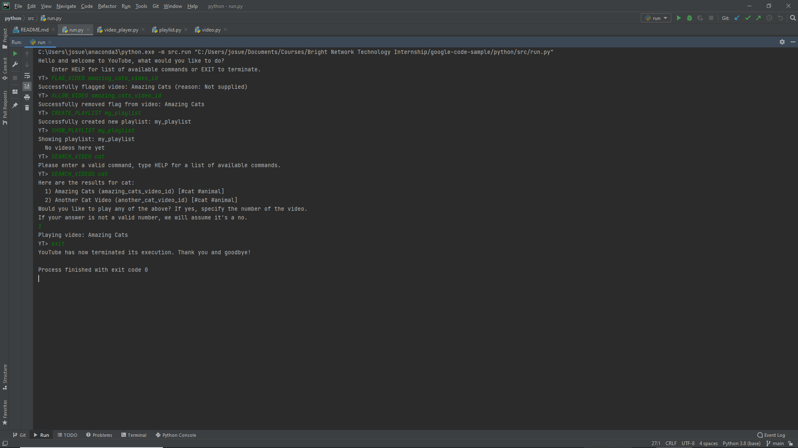
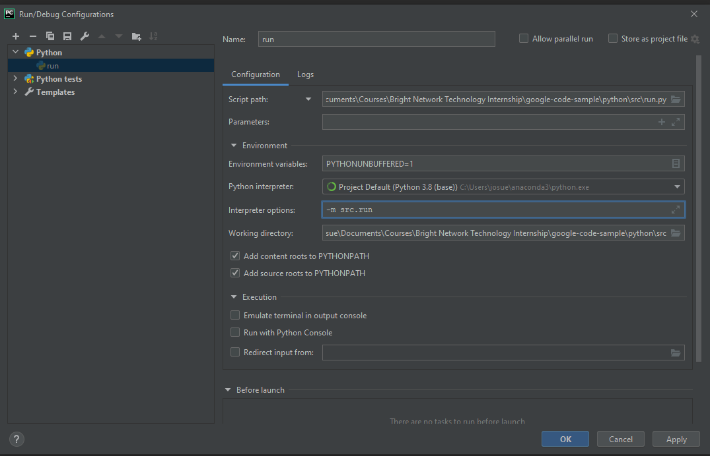
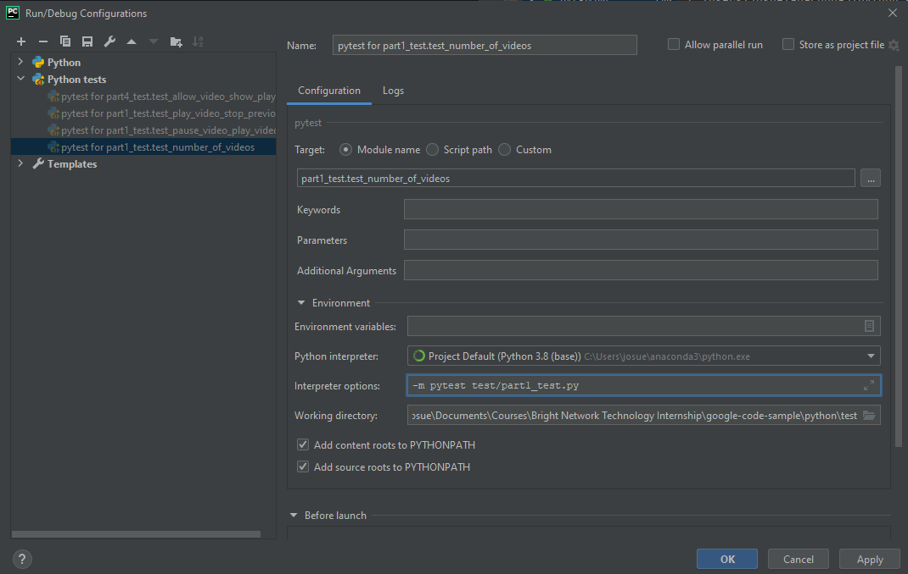

# BN2021 Google Coding Challenge
> Command-Line YouTube app mock-up program submitted as part of Google's coding challenge for the
> Bright Network Internship, Technology 2021

## Table of Contents
* [General Info](#general-information)
* [Technologies Used](#technologies-used)
* [Features](#features)
* [Screenshots](#screenshots)
* [Setup](#setup)
* [Usage](#usage)
* [Project Status](#project-status)
* [Acknowledgements](#acknowledgements)
* [Contact](#contact)
<!-- * [License](#license) -->

## General Information
- The app is an implementation of different sorting, searching and IO methods meant to simulate the workings of
- YouTube in a Command-Line environment (ie. without the web element)
- The app lets you simulate playing and stopping videos, managing playlists and searching videos by name and tag
- This project was implemented as a submission to the Google Coding challenge for Bright Network Internship Technology 2021

## Technologies Used
- Python - version 3.9

## Features
- NUMBER_OF_VIDEOS: returns the number of videos stored in the video library
- SHOW_ALL_VIDEOS: displays a list of all videos in the library by lexicographical order
- PLAY <video_id>: simulates playing a video specified using an alphanumeric id with no whitespaces
- STOP: simulates stopping the video that is currently playing
- PLAY_RANDOM: selects a random, unflagged video from the library and plays it
- PAUSE: simulates pausing the video that is currently playing
- CONTINUE: simulates resuming the video that was paused
- SHOW_PLAYING: displays the video that is currently being played along with its state (PAUSED or not)
- CREATE-PLAYLIST <playlist_name>: simulates creating a playlist 
- ADD_TO_PLAYLIST <playlist_name><video_id>: simulates adding a video to a playlist
- SHOW_ALL_PLAYLISTS: displays a list of all the names of the created playlists
- SHOW_PLAYLIST <playlist_name>: shows all videos in a playlist
- REMOVE_FROM_PLAYLIST <playlist_name><video_id>: simulates deleting a video from a playlist
- CLEAR_PLAYLIST <playlist_name>: deletes all videos from a playlist without deleting the playlist
- DELETE_PLAYLIST <playlist_name>: deletes a playlist and its content from the video player
- SEARCH_VIDEOS <search_term>: searches videos by title given a string pattern to lookup
- SEARCH_VIDEOS_WITH_TAG <tag_name>: searches videos by tag given a string pattern to lookup
- FLAG_VIDEO <video_id><flag_reason>: flags a video so it can't be added to a playlist or reproduced, optional attribute provides reason for flagging or defaults to "Not provided" if omitted
- ALLOW_VIDEO <video_id>: allows users to unflag video 

## Screenshots

## Setup
What are the project requirements/dependencies? Where are they listed? A requirements.txt or a Pipfile.lock file perhaps? Where is it located?

- Python 3+ installed
- pytest module (pip install pytest)

Run program using python3 -m src.run

Run tests using python3 -m pytest 

## Usage
How does one go about using it?

Use one of the commands listed above along with the required arguments.
Arguments should not contain any whitespaces.

Example:

`YT> CREATE_PLAYLIST my_playlist_name`

## Project Status
Project is:  _complete_

## Acknowledgements

- This project was based on Google's Coding Challenge for the Bright Network Technology Internship 2021.

## Contact
VideoPlayer solution by [@josflesan](josue.fle.sanc@gmail.com) - feel free to contact me!
